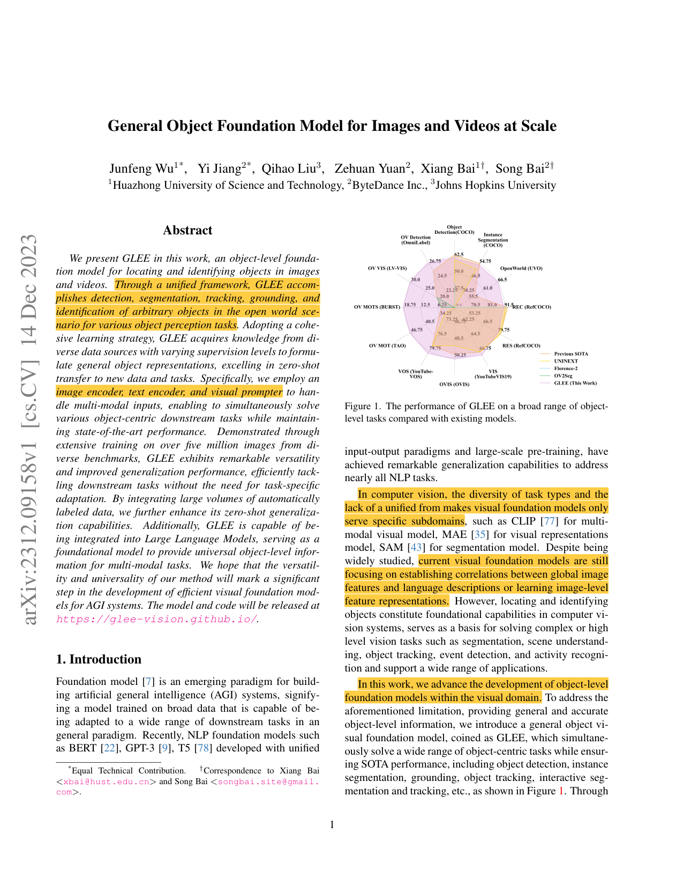
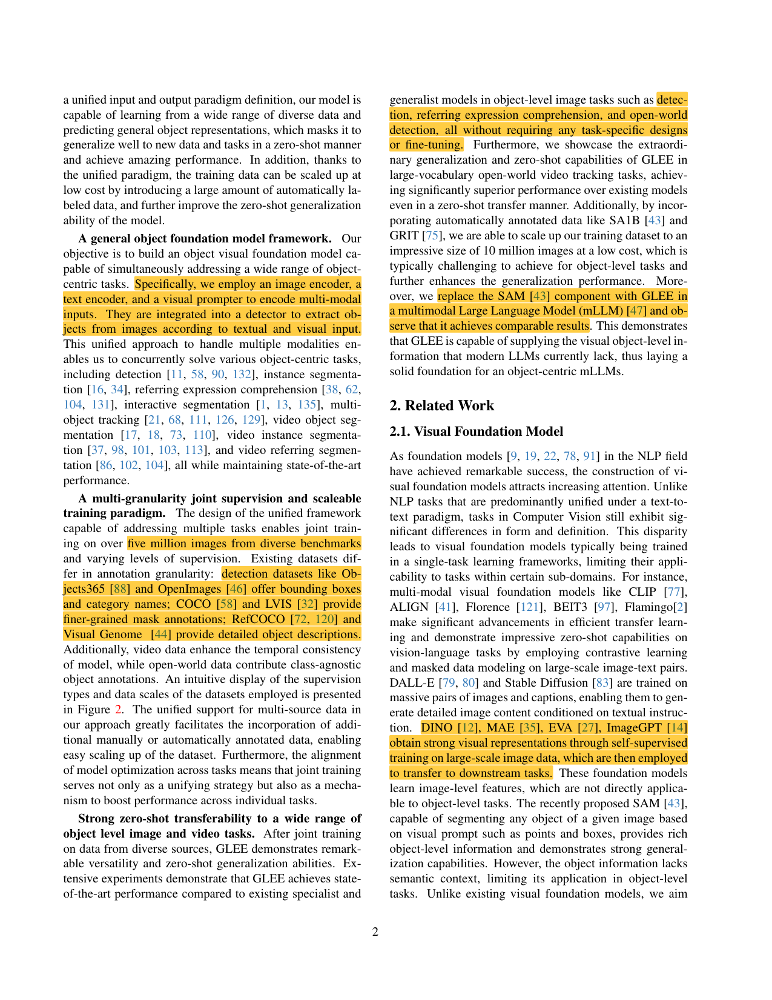
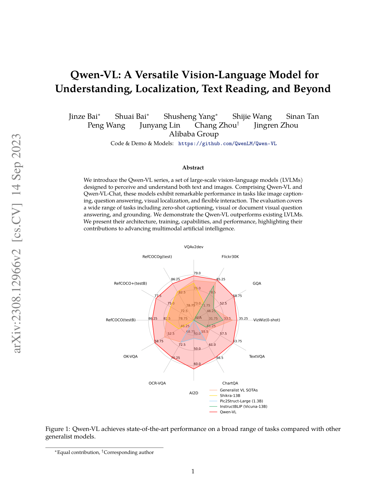
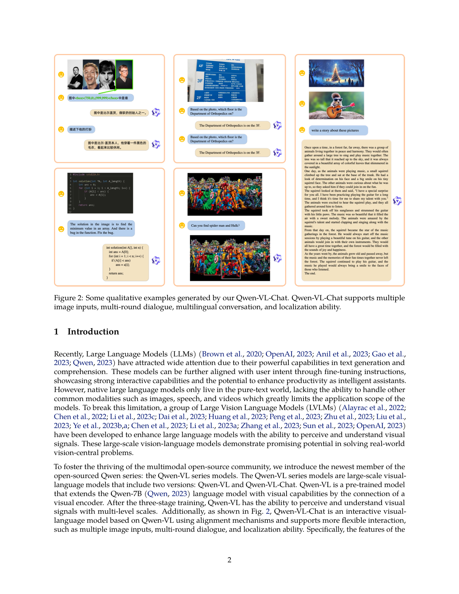

# 📚 Week_01 论文精选

## [GLEE](GLEE.pdf)

**📝 摘要**：

> We present GLEE in this work, an object-level founda-
tion model for locating and identifying objects in images
and videos. Through a unified framework, GLEE accom-
plishes detection, segmentation, tracking, grounding, and
identification of arbitrary objects in the open world sce-
nario for various object perception tasks. Adopting a cohe-
sive learning strategy, GLEE acquires knowledge from di-
verse data sources with varying supervision levels to formu-
late general object representations, excelling in zero-shot
transfer to new data and tasks. Specifically, we employ an
image encoder, text encoder, and visual prompter to han-
dle multi-modal inputs, enabling to simultaneously solve
various object-centric downstream tasks while maintain-
ing state-of-the-art performance.

<table><tr>
  <td></td>
  <td></td>
</tr></table>

## [qwen-vl](qwen-vl.pdf)

**📝 摘要**：

> We introduce the Qwen-VL series, a set of large-scale vision-language models (LVLMs)
designed to perceive and understand both text and images. Comprising Qwen-VL and
Qwen-VL-Chat, these models exhibit remarkable performance in tasks like image caption-
ing, question answering, visual localization, and flexible interaction. The evaluation covers
a wide range of tasks including zero-shot captioning, visual or document visual question
answering, and grounding. We demonstrate the Qwen-VL outperforms existing LVLMs.
We present their architecture, training, capabilities, and performance, highlighting their
contributions to advancing multimodal artificial intelligence.
Figure 1: Qwen-VL achieves state-of-the-art performance on a broad range of tasks compared with other
generalist models.
∗Equal contribution, †Corresponding author
1
arXiv:2308.12966v2  [cs.CV]  14 Sep 2023
Figure 2: Some qualitative examples generated by our Qwen-VL-Chat. Qwen-VL-Chat supports multiple
image inputs, multi-roun

<table><tr>
  <td></td>
  <td></td>
</tr></table>

