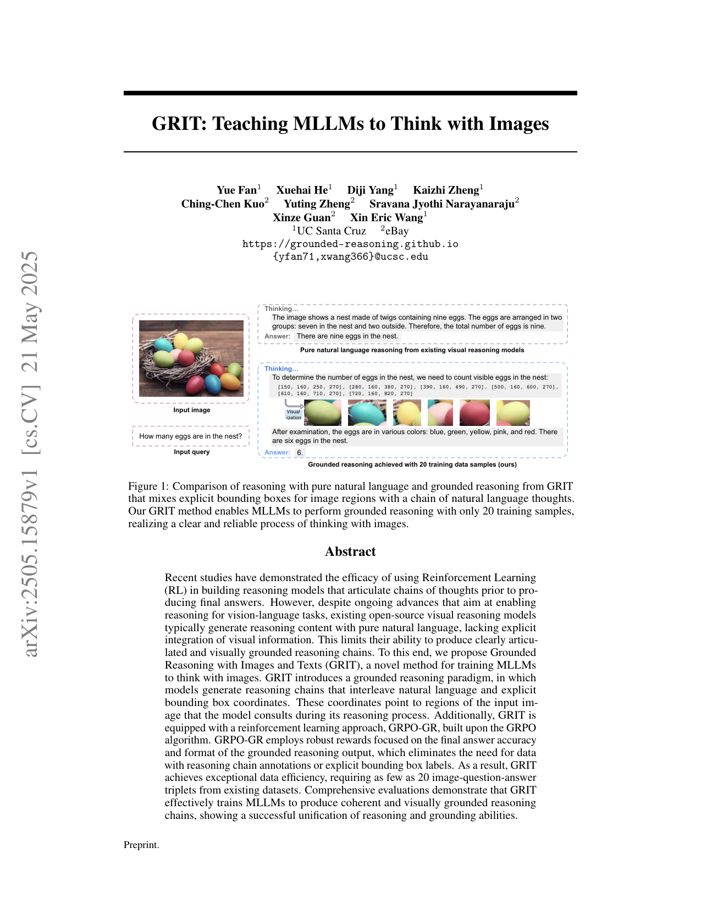
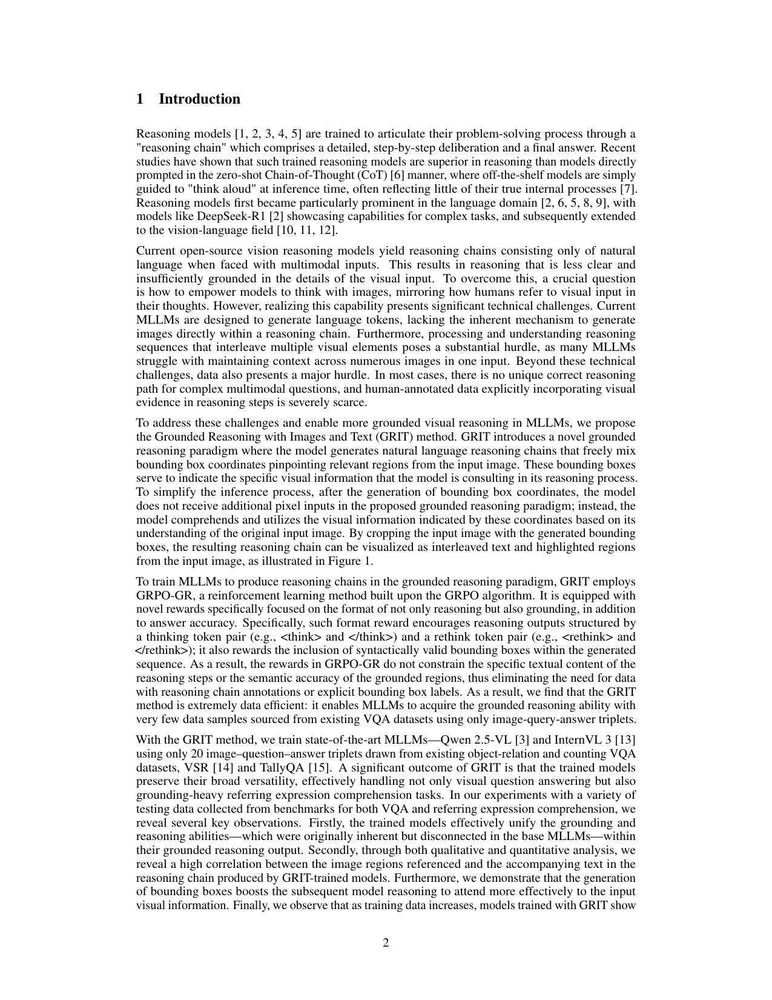
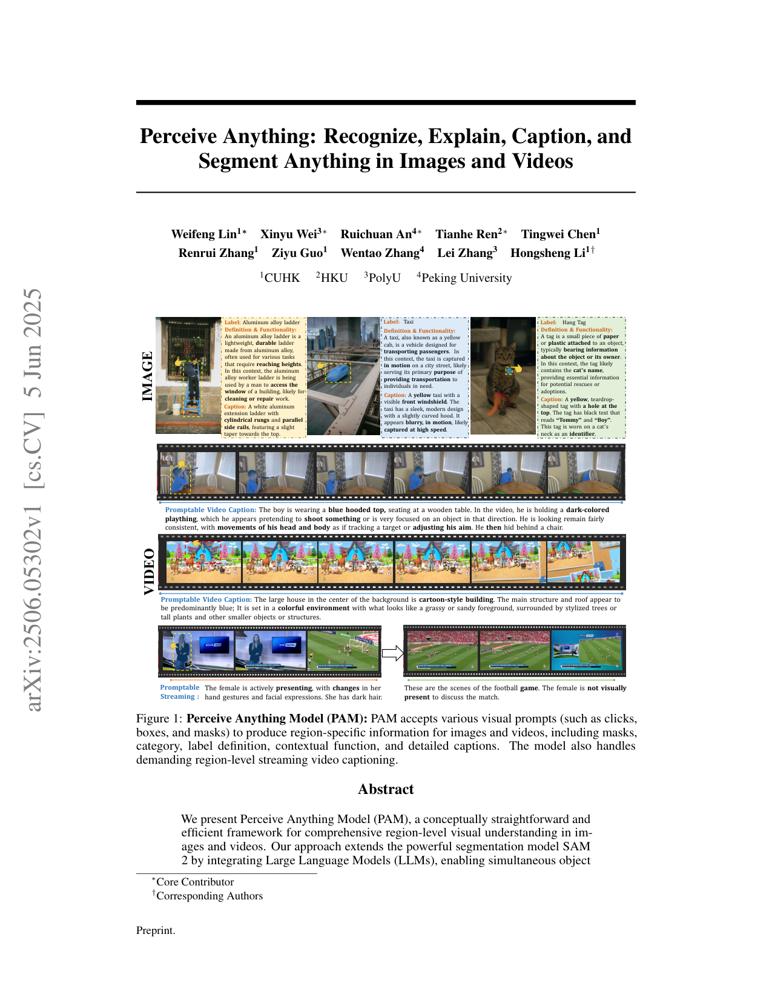
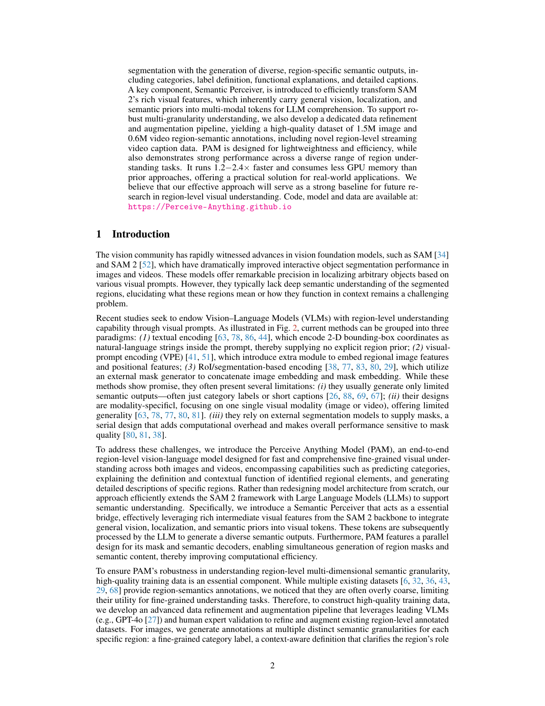
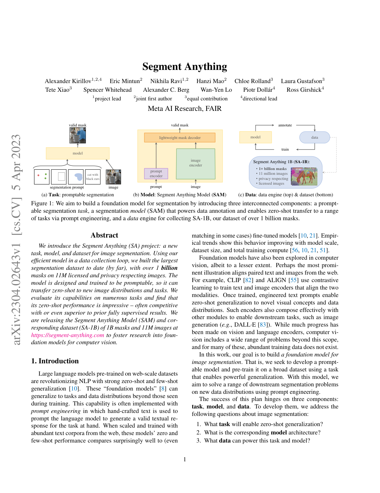
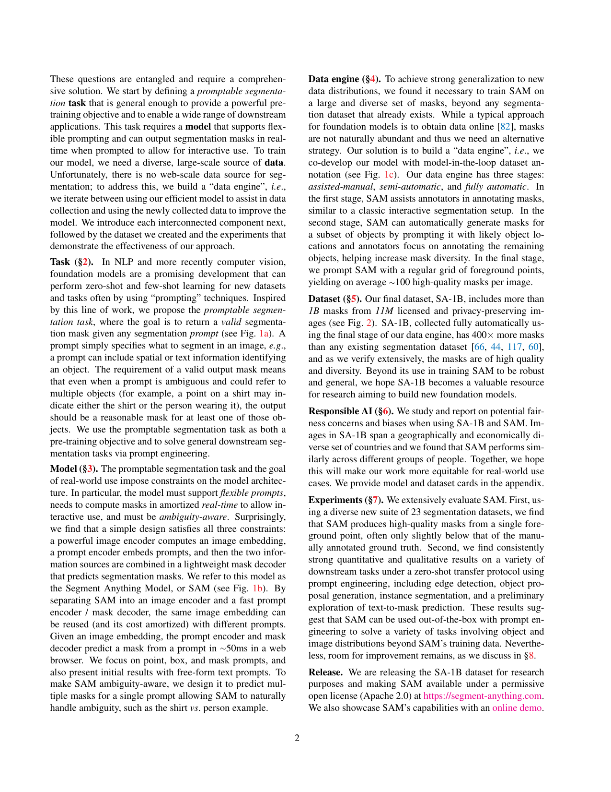
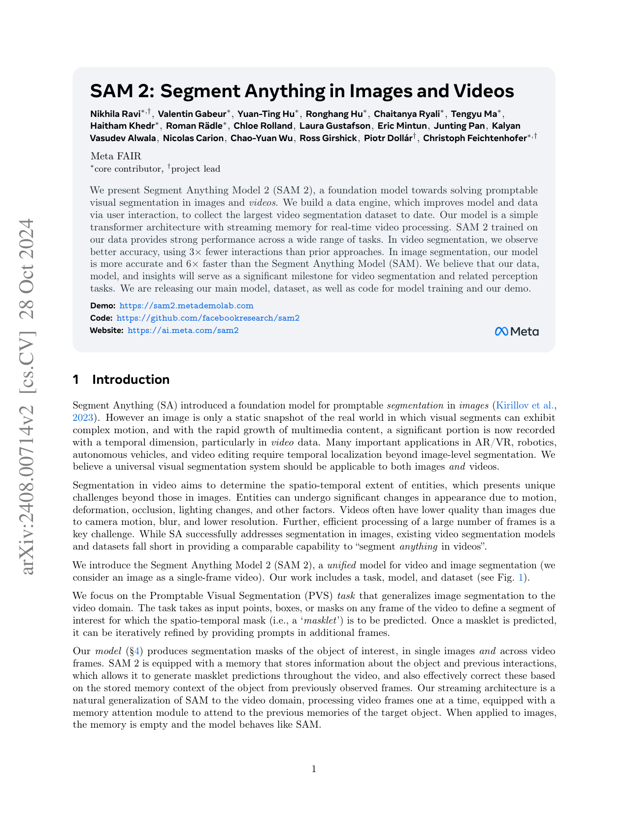
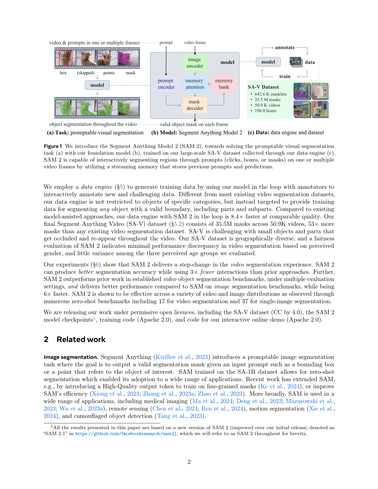

# 📚 Week_02 论文精选

## [GRIT](GRIT.pdf)

**📝 摘要**：

> Recent studies have demonstrated the efficacy of using Reinforcement Learning
(RL) in building reasoning models that articulate chains of thoughts prior to pro-
ducing final answers. However, despite ongoing advances that aim at enabling
reasoning for vision-language tasks, existing open-source visual reasoning models
typically generate reasoning content with pure natural language, lacking explicit
integration of visual information. This limits their ability to produce clearly articu-
lated and visually grounded reasoning chains. To this end, we propose Grounded

<table><tr>
  <td></td>
  <td></td>
</tr></table>

## [PAM](PAM.pdf)

**📝 摘要**：

> We present Perceive Anything Model (PAM), a conceptually straightforward and
efficient framework for comprehensive region-level visual understanding in im-
ages and videos. Our approach extends the powerful segmentation model SAM
2 by integrating Large Language Models (LLMs), enabling simultaneous object
∗Core Contributor
†Corresponding Authors

<table><tr>
  <td></td>
  <td></td>
</tr></table>

## [SAM](SAM.pdf)

**📝 摘要**：

> We introduce the Segment Anything (SA) project: a new
task, model, and dataset for image segmentation. Using our
efficient model in a data collection loop, we built the largest
segmentation dataset to date (by far), with over 1 billion
masks on 11M licensed and privacy respecting images. The
model is designed and trained to be promptable, so it can
transfer zero-shot to new image distributions and tasks. We
evaluate its capabilities on numerous tasks and find that
its zero-shot performance is impressive – often competitive
with or even superior to prior fully supervised results. We
are releasing the Segment Anything Model (SAM) and cor-
responding dataset (SA-1B) of 1B masks and 11M images at
https://segment-anything.com to foster research into foun-
dation models for computer vision.
1. Introduction

<table><tr>
  <td></td>
  <td></td>
</tr></table>

## [SAM2](SAM2.pdf)

<table><tr>
  <td></td>
  <td></td>
</tr></table>

