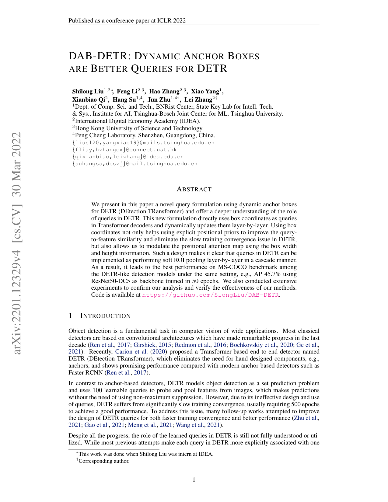
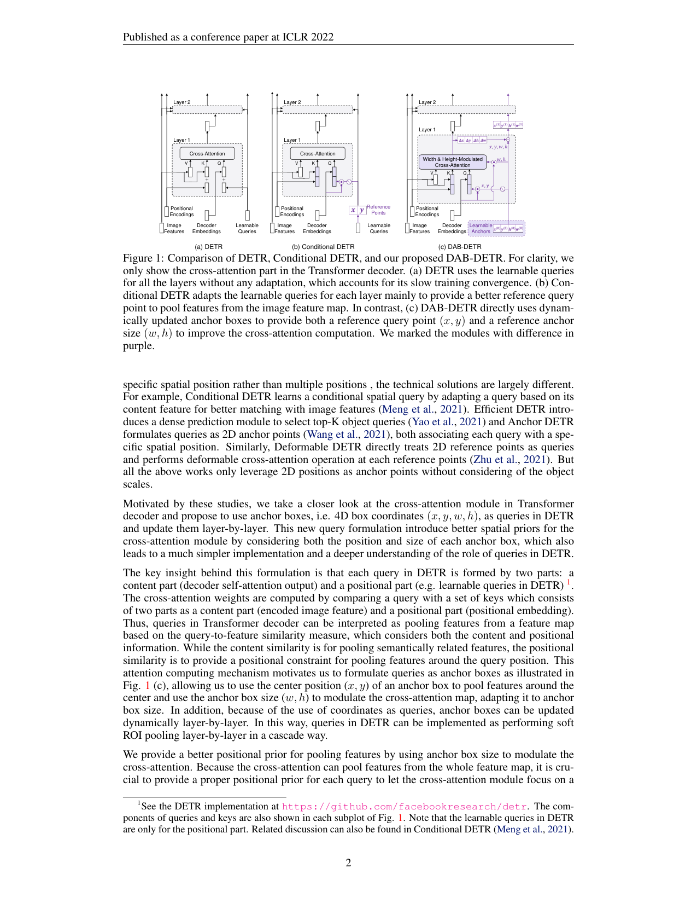
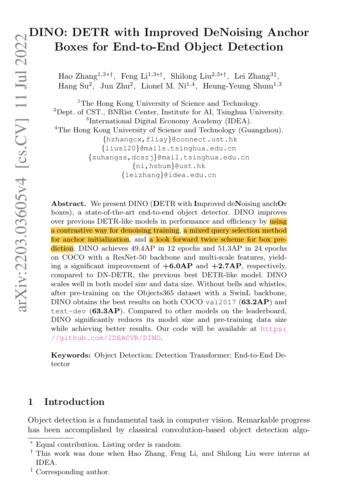
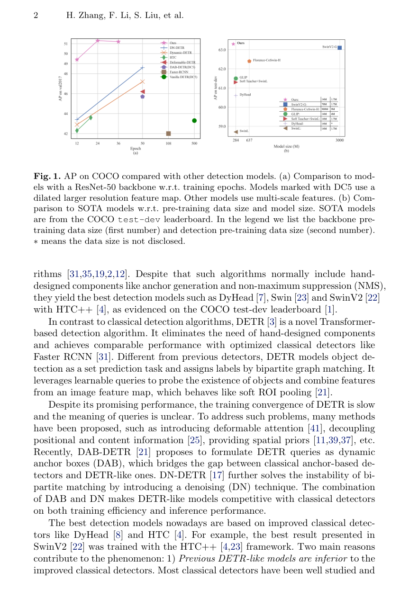
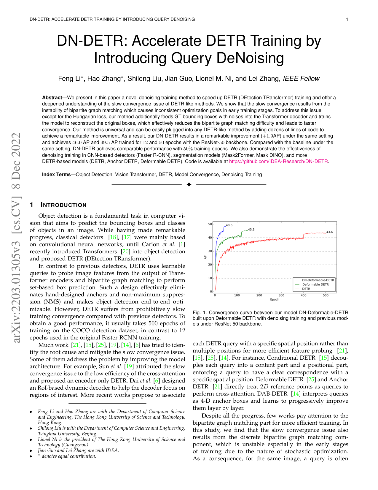
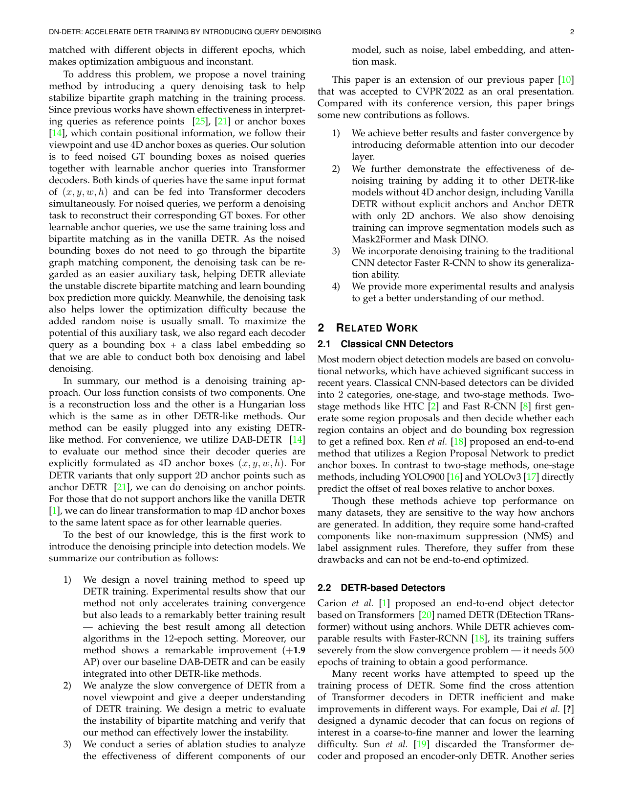

# 📚 Week_03 论文精选

## [DAB-DETR](DAB-DETR.pdf)

**📝 摘要**：

> We present in this paper a novel query formulation using dynamic anchor boxes
for DETR (DEtection TRansformer) and offer a deeper understanding of the role
of queries in DETR. This new formulation directly uses box coordinates as queries
in Transformer decoders and dynamically updates them layer-by-layer. Using box
coordinates not only helps using explicit positional priors to improve the query-
to-feature similarity and eliminate the slow training convergence issue in DETR,
but also allows us to modulate the positional attention map using the box width
and height information. Such a design makes it clear that queries in DETR can be
implemented as performing soft ROI pooling layer-by-layer in a cascade manner.

<table><tr>
  <td></td>
  <td></td>
</tr></table>

## [DINO](DINO.pdf)

**📝 摘要**：

> . We present DINO (DETR with Improved deNoising anchOr
boxes), a state-of-the-art end-to-end object detector. DINO improves
over previous DETR-like models in performance and efficiency by using
a contrastive way for denoising training, a mixed query selection method
for anchor initialization, and a look forward twice scheme for box pre-
diction. DINO achieves 49.4AP in 12 epochs and 51.3AP in 24 epochs
on COCO with a ResNet-50 backbone and multi-scale features, yield-
ing a significant improvement of +6.0AP and +2.7AP, respectively,
compared to DN-DETR, the previous best DETR-like model. DINO
scales well in both model size and data size. Without bells and whistles,
after pre-training on the Objects365 dataset with a SwinL backbone,

<table><tr>
  <td></td>
  <td></td>
</tr></table>

## [DN-DETR](DN-DETR.pdf)

**📝 摘要**：

> —We present in this paper a novel denoising training method to speed up DETR (DEtection TRansformer) training and offer a
deepened understanding of the slow convergence issue of DETR-like methods. We show that the slow convergence results from the
instability of bipartite graph matching which causes inconsistent optimization goals in early training stages. To address this issue,
except for the Hungarian loss, our method additionally feeds GT bounding boxes with noises into the Transformer decoder and trains
the model to reconstruct the original boxes, which effectively reduces the bipartite graph matching difficulty and leads to faster
convergence. Our method is universal and can be easily plugged into any DETR-like method by adding dozens of lines of code to
achieve a remarkable improvement. As a result, our DN-DETR results in a remarkable improvement (+1.9AP) under the same setting
and achieves 46.0 AP and 49.5 AP trained for 12 and 50 epochs with the ResNet-50 backbone. Compared wit

<table><tr>
  <td></td>
  <td></td>
</tr></table>

## [Mask DINO](Mask_DINO.pdf)

**📝 摘要**：

> In this paper we present Mask DINO, a unified object
detection and segmentation framework. Mask DINO extends

<table><tr>
  <td></td>
  <td></td>
</tr></table>

